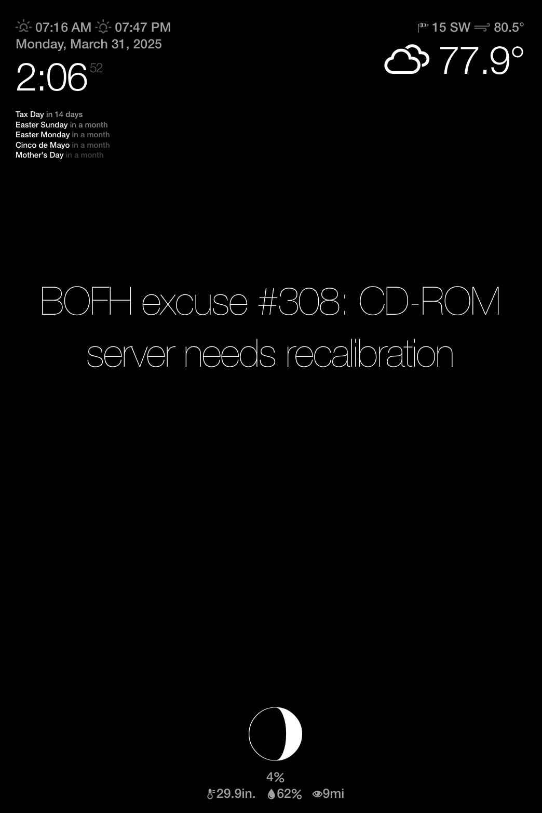

# 🪞 Magic Mirror on Raspberry Pi

This project is a custom-built **Magic Mirror** running on a **Raspberry Pi**, using a **stripped-down LCD monitor** placed behind a **one-way mirror glass**. It's a sleek and nerdy smart display for your wall, desk, or lab—displaying real-time info in a minimalist aesthetic.

---



---

## 🧠 Features

This Magic Mirror displays:

- 🕒 **Current Time & Date**
- ☁️ **Live Weather** (temperature, condition, humidity, etc.)
- 🌬️ **Wind Speed & Direction**
- 📉 **Barometric Pressure**
- 🌙 **Moon Phase**
- 📅 **Upcoming Holidays**
- 💻 **BOFH Excuses** (because why not?)

All of this is presented in a clean, always-on dashboard behind a one-way mirror, making it look like information is floating right in the glass.

---

## 🧰 Hardware

- **Raspberry Pi** (any model that supports your screen and Wi-Fi should work)
- **LCD Monitor** (gutted from its casing)
- **One-Way Mirror Glass** (also called a spy mirror)
- **Frame** or Enclosure (custom or repurposed picture frame)
- **Power Supply** (for Pi and monitor)

Optional but recommended:
- **Wi-Fi Dongle** (if Pi doesn’t have Wi-Fi)

---

## 🔧 Setup

### Install Raspbian GNU/Linux 10 (buster) lite because this is a **REALLY** old Raspberry Pi.
### Install API Packages
```
sudo apt install -y nginx-full git python3-venv chromium-browser xserver-xorg x11-xserver-utils xinit openbox fortunes-bofh-excuses
```

### git clone
```
git clone https://github.com/ltdenard/magic_mirror.git
```

### copy contents of autostart file to 
```
sudo cp -f autostart /etc/xdg/openbox/autostart
```

### disable cursor, enabled autologin, and set the background to solid black
```
cp -f bash_profile ~/.bash_profile
touch ~/.hushlogin
sudo cp -f autologin.conf /etc/systemd/system/getty@tty1.service.d/autologin.conf
cp -f desktop-items-0.conf ~/.config/pcmanfm/LXDE-pi/desktop-items-0.conf
```

### disable the splash screen, and rotate the display
```
echo "disable_splash=1" |sudo tee -a /boot/config.txt
echo "display_hdmi_rotate=3" |sudo tee -a /boot/config.txt
echo "disable_overscan=1" |sudo tee -a /boot/config.txt
```
### copy webserver contents
```
sudo cp -f html/* /var/www/html/
sudo chmod -R 755 /var/www/html/
```

### update config.js
### Generate an API key for weather api [here](https://www.weatherapi.com/).
### Generate an API key from google cloud console [here](https://console.cloud.google.com). You'll also need to enable the Google Calendar API.
### NOTE: this is insecure way of doing api keys, but since it's just a webserver hosted for a local system dashboard, we're doing this to keep complexity low.
```
echo 'var API_KEY = "WEATHERAPIKEY";' | sudo tee /var/www/html/js/config.js
echo 'var ZIP_CODE = "ZIPCODEHERE";' | sudo tee /var/www/html/js/config.js
echo 'var GOOGLE_KEY = "GOOGLEAPIKEY";' | sudo tee /var/www/html/js/config.js
```

### reboot
```
sudo reboot
```